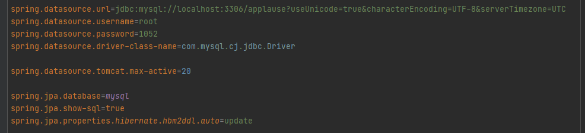
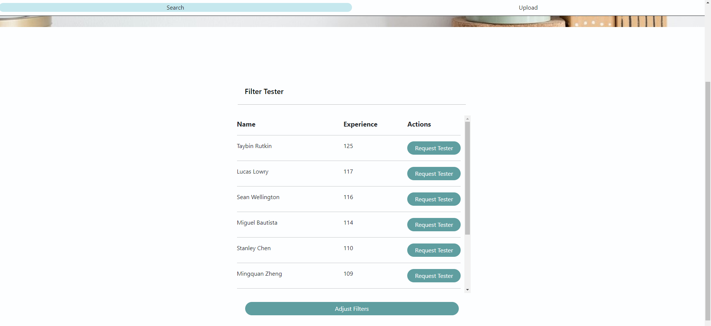

# Applause-Demo
# Setup
For this project, I used Spring Boot, JPA, Hibernate, and MySQL as the backend server. And I used react JS for the front-end.

To run this code, you will need an IDE that has a spring boot workspace. For example, IntelliJ or VS Code with the spring boot dashboard extension.

We will first need a schema for the database.
In my case, the schema is named "applause".
This can be changed in the application.properties file at "backend\src\main\resources\"

Change the URL to whichever port your MySQL server is running on and the "applause" in the URL to whatever name you have chosen.

Change the username and password and the database will be all set!

Find the "database.sql" file in the folder "/backend/database.sql"
and run the code in your MySQL CLI or Workbench

Run the backend server with your IDE and now let's start the front-end server!

You will need to enter the "frontend/applause_demo" folder and run 
    
    yarn install
    
    yarn start

to begin the front-end server.

1. Create a schema and name it "applause" or [Your Name of choice]

2. Change the port number and schema name in the spring.datasource.url to match your configuration

3. Change the user and password to allow access

4. Run the database.sql code in the backend folder in your mysql CLI or Workbench

5. Run the yarn install and run commands in the frontend/applause-demo folder

# Results
Once everything is running, you will be welcomed with the front page.

There are two options in the navbar. For any meaningful results, we must first upload the required files.

Once everything is uploaded, we can begin our search.

Click on the filter type dropdown button and choose between filtering a country or a device.

Once selected, a new dropdown will appear and you will need to specify the country or device to add to our filter.

Once both are selected, click on the + button to add the filter.

Keep adding filters according to your needs.

Once you have set up your list of filters, click on the search button to get the list of testers that fit the criteria.

If you leave the country or device empty, it will be counted as ALL countries or ALL devices.

Here is our result for all countries and all devices.

